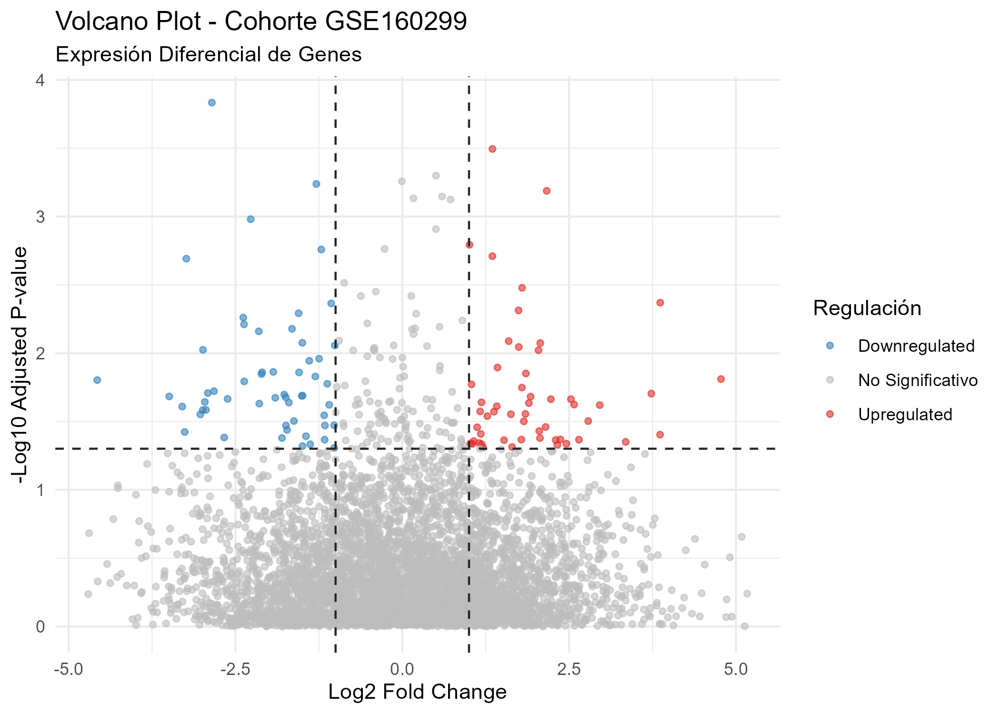

# GSE160299-Barrera-Ubaldo-Natallia
Rhistory
.RData
.Ruserdata
.Rproj.user/
data/
# Análisis de Expresión Diferencial - Cohorte GSE160299

Este repositorio contiene un flujo de trabajo optimizado en R para la descarga, normalización, análisis de expresión diferencial y visualización de datos transcriptómicos correspondientes a la cohorte **GSE160299**.

## 📁 Estructura del Repositorio
- `computo_cientifico.R`: Script limpio que procesa los datos y genera los outputs.
- `results/`: Carpeta que almacena las figuras exportadas.
  - `volcano_plot.png`: Gráfico estadístico de los niveles de expresión.

## 📊 Resultados Principales (Volcano Plot)

A continuación se presenta la gráfica de volcán obtenida, donde se destacan los genes significativamente sobreexpresados (**Upregulated** en rojo) y subexpresados (**Downregulated** en azul):

## 🛠️ Requisitos
El script fue ejecutado utilizando R 4.6.0 y requiere los siguientes paquetes instalados:
- `ggplot2`
- `GEOquery`
- `limma`
